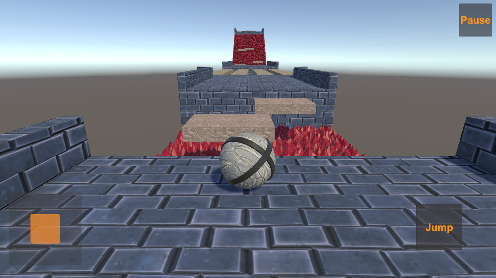
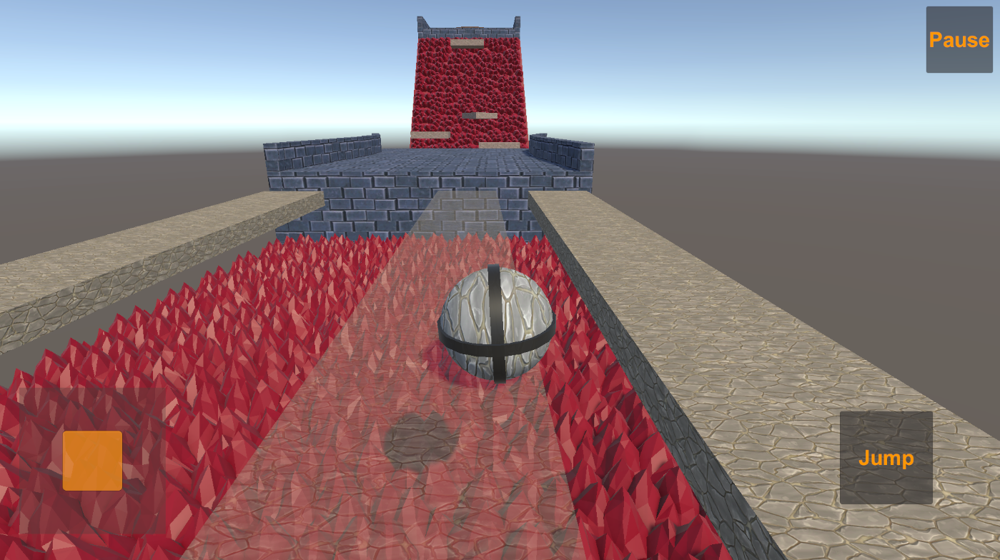

# ▎Game Title: Obstacle Course

▎1. Introduction

Welcome to the project! This project is created to demonstrate skills in game development and will be actively updated as new features are implemented and tested. The game is a 3D platformer where players control a character as they tackle various challenges.

▎2. Game Overview

• Genre: 3D Platformer

• Platform: PC (with plans for console and mobile later)

• Target Audience: Medium intensity gamers aged 10 and up

▎3. Gameplay Mechanics

• Core Gameplay: Players guide a character (ball) through a level packed with tricky obstacles. The goal - navigate to the finish around deadly pits while jumping on moving and destructible platforms using different bonuses (and other obstacles in future).

• Character Movement:

  • Implemented using Unity’s Character Controller for smooth movement.

  • Controls available via keyboard/mouse and HUD controller, making it easy to adapt for different platforms.

• Progression System: Game progress is saved upon overcoming obstacles.

▎4. Level Design

• Current Level: One level designed with exciting challenges:

  • Deadly Pits: Watch out! Falling in means instant death.

  • Moving Platforms: Timing is key to hop onto these.

  • Destructible Platforms: Step on these, and they’ll disappear!

▎5. User Interface

• Adaptive UI: Interface is designed to look great on various screen sizes.

▎6. Tools and Technologies

• In order to ensure the scalability of the project, special attention was paid to the OOP approach and SOLID principles, dependencies inversion and separating responsibilities between different entities during the development of the architecture.

• Unity Standard Features:

  • ProBuilder for crafting levels.

  • TextMeshPro for sharp text rendering.

  • Cinemachine for dynamic camera action.

• Plugins:

  • DOTween: For smooth animations of both 3D objects and UI elements.

  • Zenject: For dependency injection.

▎7. Design Patterns Implemented (partially)

• EventBus: For event management across the game.

• Object Pool: To optimize performance by reusing objects.

• Observer: For managing game events and state changes.

• Singleton: To Manage global instances (using Zenject).

▎8. Future Development Plans

• Upcoming Features:

  • Improving the visual component of the game: adding environment, effects and nice looking textures.

  • Implementing State/Behavior patterns for character animations and states.

  • Using the Decorator pattern for temporary buffs and bonuses.

  • Implementing Repository-Interactor-Gameplay architecture (part of MVVM pattern) for resource collection and customization.

  • Revamping the user interface for improved user experience.

  • Introducing multiplayer features using Photon, allowing players to race against each other with some fun interference.

  • Adding character skin selection and saving player statistics with JSON and XML data serialization.

  • New level with raycast mechanics

▎9. Conclusion

This design document outlines the current state of the project and its future direction. As development progresses, the game will evolve with new features and improvements.
---

Thanks for checking out this design document!

