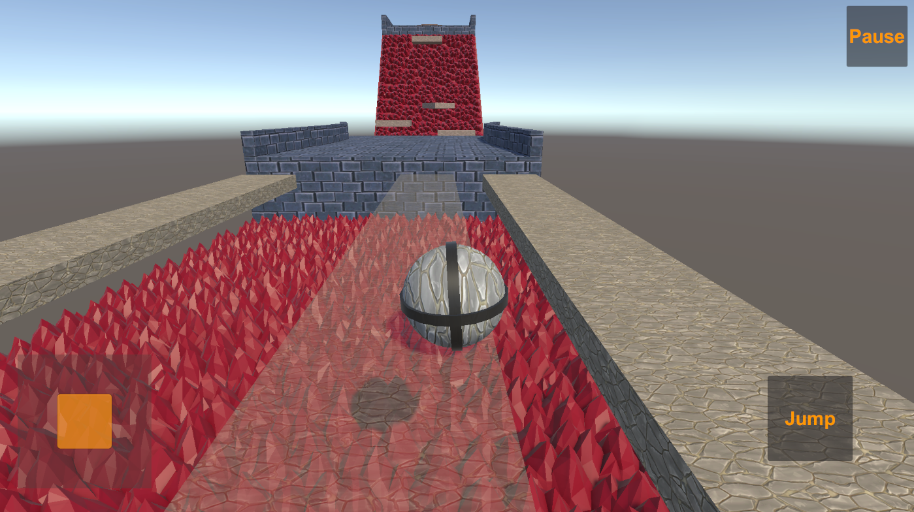

# ▎Название игры: Obstacle Course

▎1. Введение

Добро пожаловать! Этот проект создан для демонстрации моих навыков в разработке игр и будет активно обновляться по мере внедрения и тестирования новых функций. Игра представляет собой 3D-платформер, где игрок управляет персонажем, преодолевая различные испытания.

▎2. Обзор игры

• Жанр: 3D-Платформер

• Платформа: ПК (с планами на консоли и мобильные устройства позже)

• Целевая аудитория: Среднехардкорные игроки в возрасте от 10 лет и старше

▎3. Игровая механика

• Основной игровой процесс: Игрок направлет персонажа (шар) через уровень, наполненный различными препятствиями. Цель - пройти к финишу через смертельные препятствия, прыгая на движущиеся и разрушаемые платформы, используя различные бонусы (и другие препятствия в будущем).

• Движение персонажа:

  • Реализовано с помощью Character Controller от Unity, чтобы добиться плавного движения.

  • Управление реализовано как для клавиатуры и мыши, так и для HUD контроллера, что облегчает адаптацию для разных платформ.

• Система прогрессии: Прогресс игрока будет сохраняться каждый раз, когда он преодолевает препятствие.

▎4. Дизайн уровней

• Текущий уровень:

  • Смертельные ямы: Падение в них означает мгновенную смерть.

  • Движущиеся платформы: Важно правильно рассчитать время, чтобы запрыгнуть на них.

  • Разрушаемые платформы: Исчезают со временем после контакта с игроком.

▎5. Пользовательский интерфейс

• Адаптивный UI: Интерфейс разработан так, чтобы отлично выглядеть на экранах разных размеров.

▎6. Инструменты и технологии

• В целях обеспечения масштабируемости проекта при разработке архитектуры особое внимание уделялось подходу ООП и принципам SOLID, инверсии зависимостей и разделению ответственности между различными сущностями.

• Стандартные инструменты Unity:

  • ProBuilder для создания уровней.

  • TextMeshPro для четкого отображения текста.

  • Cinemachine для удобного управления камерой.

• Сторонние библиотеки:

  • DOTween: Для плавной анимации 3D объектов и элементов UI.

  • Zenject: Для внедрения зависимостей.

▎7. Реализованные паттерны проектирования (частично):

• EventBus: Для управления событиями, происходящими в игре.

• Object Pool: Оптимизирует производительность, повторно используя объекты вместо создания новых.

• Observer: Для эффективного контроля игровых событий и изменения состояний.

• Singleton: Управляет глобальными игровыми сущностями (используя Zenject).

▎8. Дальнейшие планы

  • Использование паттерна состояния/поведения (State) для анимации персонажа.

  • Использование паттерна Decorator для временных усилений и бонусов.

  • Реализация архитектуры Repository-Interactor-Gameplay (часть паттерна MVVM) для сбора ресурсов и кастомизации.

  • Переработка пользовательского интерфейса для улучшения игрового опыта.

  • Введение режима multiplayer с использованием Photon, в котором игроки будут соревноваться друг с другом в скорости прохождения уровней, мешая друг другу различными способами.

  • Добавление выбора скинов персонажей и сохранение статистики игроков, используя cериализацию данных в JSON и XML.

  • Новый уровень с механикой Raycast-а.

▎9. Заключение

Этот документ описывает текущее состояние проекта и направление его развития. Со временем игра будет дополняться новыми функциями и механиками.
---

Спасибо за ознакомление с этим design document-ом!

